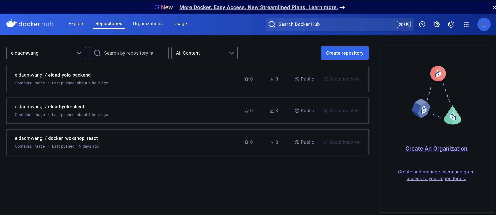

# Overview
This project involved the containerization and deployment of a full-stack yolo application using Docker.

# Requirements
Install the docker engine here:
- [Docker](https://docs.docker.com/engine/install/) 

## How to launch the application 

## How to run the app
Use vagrant up --provison command

# Summary Notes for Docker Compose Setup
Docker Compose File:

Version: 3.8
Defines three main services: React frontend, Node.js backend, and MongoDB database.
Frontend (React):

# Service Name: eldad-yolo-client
Ports: Exposes 3000:3000
Depends On: Backend service (eldad-yolo-backend)
Build: From ./client directory
Backend (Node.js):

# Service Name: eldad-yolo-backend
Ports: Exposes 4000:4000
Depends On: MongoDB service (app-ip-mongo)
Build: From ./backend directory
Restart Policy: Always restart on failure
MongoDB (Database):

# Service Name: app-ip-mongo
Ports: Exposes 27017:27017
Volume: Data persists via app-mongo-data volume
Network:

Custom bridge network app-net
Configured with subnet 172.20.0.0/16
Volumes:

# MongoDB Volume: app-mongo-data for persistent database storage
Backend Dockerfile
Uses Node 16 based on Alpine Linux.
Installs production dependencies, removes development files.
Exposes port 4000.
Starts app using npm start.
Frontend Dockerfile (Multistage)
Build Stage: Builds the React app with production dependencies.
Production Stage: Copies build files from the build stage.
Exposes port 3000 and starts the app using npm start.
Key Commands
Build and Run: docker-compose up --build
Stop Containers: docker-compose down
View Logs: docker-compose logs <service-name>
Access the Application
Frontend: http://localhost:3000
Backend: http://localhost:4000
